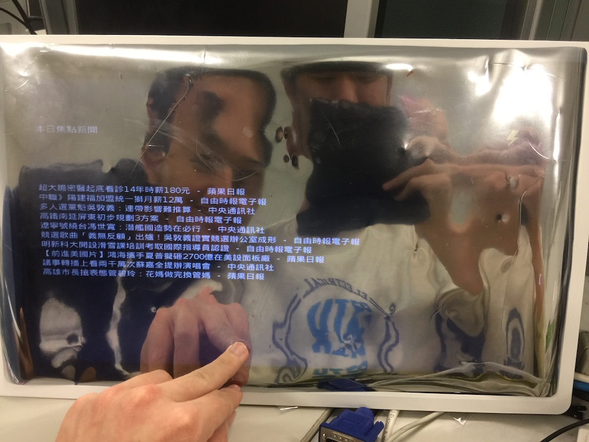
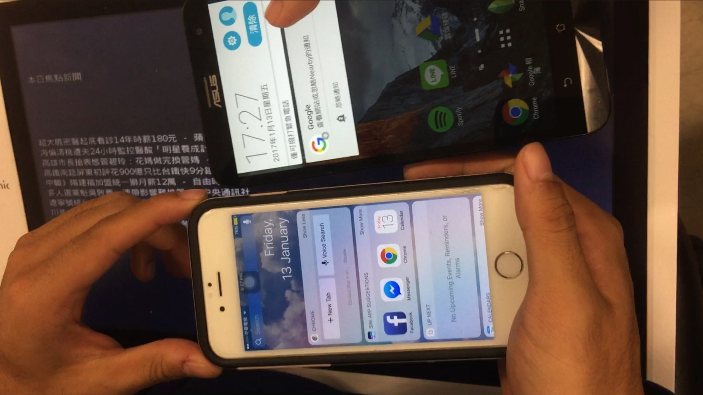

# 嵌入式系統實驗, Fall 2016
## Final Project - Magic Mirror

### 指導教授：王勝德 教授	
###B03901023  電機三  許秉鈞,  B03901041 電機三 王文謙
## 題目
<b>Magic Mirror （醜男鏡）</b>

## 成員
<b> B03901023  電機三  許秉鈞,  B03901041 電機三 王文謙</b>

## 摘要

我們希望製作一組智慧物聯網系統，以家裡梳妝台、或是廁所的鏡子為系統中心，透過藍芽等方式和使用者進行溝通，並利用臉部辨識、機器學習進行客製化，讓每日資訊更便捷的獲取。 

## 發想

一開始是從corning這家玻璃材料公司的概念影片，他們拍攝了一連串以家中鏡子與任何可反光物體作為互動媒介，舉例來說：廁所的鏡子有本日新聞與天氣的摘要；利用房間玻璃可以聲控開關燈；就連家中的冰箱表面，都可以是數位的電子相框。我們覺得這樣的概念很好玩很想試試，於是上網查R pi能否做類似的應用，發現真的有人做過將R pi結合一般觸控螢幕、這樣的智慧鏡子，這就是我們的概念發想由來。 

## 實作
分成好幾個檔案：
	
> main_gui.py負責呈現gui、以及利用feed parser爬取天氣時間資料；camcv/ 和 face_data.py負責臉部辨識，採用camCV、openCV以及硬體上採用r pi3自己的鏡頭；原本用bing_voice.py和tts.py利用微軟cognitive services實現聲控、後來改用Google Cloud Speech API，硬體上另外加買了音效卡與麥克風，node-eddystone內的modules利用node.js，以及github上open-source的library「node-eddystone-beacon」利用r pi3內建的BLE，來呈現出eddystone應具有的功能；bryan_dp內放置一人各50張臉部辨識採樣的照片、格式為.png。 

## 成果
我們的功能分成以下幾點： 

*  天氣、時間資料爬取 
*  pyQt5 GUI programming 
* 利用Eddystone進行手機上的每日新聞推播 
* openCV、機器學習做出臉部辨識、功能客製化 
* 語音辨識（speech-to-text, text-to-speech） 
* 仿siri的chatbot，辨識已知的語彙之後回覆 
* Microsoft cognitive services API（停用）
* Google Cloud Speech API
* 觸控切換畫面（實驗室螢幕功能支援） 

至於未完成的部分，例如：   

*  拍手關燈 
*  與手機同步的todo list 
*  MongoDB, NoSQL 
*  Google firebase 

## 問題討論：遇到的困難

### ㄧ、爬取資料： 
除了中央氣象局天氣、台灣當地時間之外，我們原本希望爬到NBA球員的比數，希望能在鏡子上呈現NBA成績；還有Google Mail的未讀郵件通知，以10sec為週期做pulling以汲取線上data[1]，去更新當前的資料。但這兩個都因為需要OAuth以及一些複雜的認證手續，我們決定晚點再做這幾個功能。 

### 二、pyQt5 GUI： 
原本是在自己的Mac OSX上面做這功能，想說做好之後直接丟到Rpi上就好。但後來雛型完成後，丟上Rpi才發現環境有些衝突、Python版本不同...等。在環境上面花了一個下午與晚上，但環境設好後就沒什麼問題。    

### 三、微軟cognitive services： 
我們用到的API有兩個：語音轉文字、文字轉語音。其實一開始是想把FaceAPI 用進來，但後來決定挑戰更難的：利用openCV來做出辨識，設計出屬於自己的code，而不是利用已有的API。在語音這塊最困難的部分，就是「如何將麥克風收到的聲音wave pattern，利用python把它轉成wav檔」。我們在這塊琢磨蠻久的，因此個人的midterm project有一部分主題也是在講voice processing。其實上網把資料查齊全後，看懂framerate=16000, sample width=2, 以及更麻煩的S6_LE和數以百盡的格式，這些都懂了後寫起code並沒有這麼難。   
另一個遇到的困難是，有一些package是只有在python2有、而有些只有在python3有，因此同份code內可能會需要py2和py3不同的幾個library，就會需要調整dependency，這部分佔了最後兩三天期末demo前，把程式碼merge的大多數時間，還蠻挫折的。  

### 四、eddystone BLE實作： 
因為是使用github上open source的套件，沒有遇到什麼問題。比較麻煩的是，無法用shorten URL所以一直處理不好。    
### 五、openCV臉部辨識： 
一開始設定camCV花了一些時間，但後來設定好後、能夠抓到臉的方匡了，就把剩下的時間拿來做training與testing。我們一開始無法分辨兩人的長相...不管如何辨識都會認成bryan，而adrian沒有認出來過，後來發現應該是參數沒調好、或是training data太少（後來30改成50張）才會造成這個結果。還有另一點是，辨識臉的時候角度很重要，如果做鬼臉之類的可能就會認不出來，我們就因為adrian在training data裡面有好幾張做鬼臉的照片，所以train的時候一直採樣怪怪的，後來重新採樣照片就可以了。 

## 心得 
這學期最好玩的課，真的非嵌入式實驗莫屬了！從一開始的rpi module教學，連command line都不太會打、只能照著老師投影片一行行輸入，img映像檔也是灌了一整天、好不容易才灌好，而且中間有遇到各種bug、來來回回也unmount重灌這塊電路板好幾次，到後來安裝Linux 系統根本就和喝水一樣日常，能夠熟悉幾個常用指令、了解kernel、IPC、GPIO的使用，都是這堂課很大的收穫。老師雖沒有規定期末project的形式，但也因為這樣我們花了好多時間在發想這次的點子，中間也不乏有一些意見不合與爭執⋯透過這樣的合作專案也讓我們看到以往一個人做project和多個人做的差異，以及溝通的重要性。就像老師說的：工程師是為了解決問題而存在，我們解決不少技術問題、同時也透過溝通合作、處理掉不少歧異，這樣的能力是非常受用的。 
最後，謝謝王老師與楊助教這學期的教導，辛苦了！ 

## 參考資料
1.Make a Raspberry Pi Gmail Notification Light: 
[http://www.makeuseof.com/tag/make-raspberry-pi-gmail-notification-light/
](http://www.makeuseof.com/tag/make-raspberry-pi-gmail-notification-light/)

## 附錄
完成版demo影片  
  

[https://youtu.be/pGQUbEfJ83I ]
(https://youtu.be/pGQUbEfJ83I )